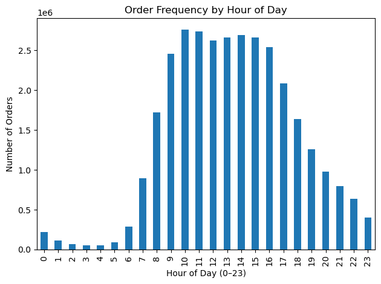

# Instacart Grocery Basket Analysis

🔎 End-to-end data cleaning, feature engineering, customer segmentation, and stakeholder-focused reporting using real-world grocery transaction data.

---

## Business Problem

Instacart wants to move beyond broad marketing and adopt targeted campaigns based on customer behavior.
Key stakeholder questions include:

- When does demand peak (day and hour)?
- Do customers behave differently by region and profile?
- How should promotions vary based on purchasing patterns and price sensitivity?

This analysis transforms raw transactional data into behavioral insights that inform campaign timing, segmentation strategy, and operational planning.

---

## Start Here (Primary Deliverable)

✅ **Final Report (Excel):** `report/Instacart_Final_Report.xlsx`

This is the main artifact for recruiters and hiring managers. It contains:

- Cleaned analytic dataset
- Segmentation outputs
- Visual summaries
- Clear business recommendations

If reviewing only one file, start here.

---

## Executive Summary

📄 `report/Instacart Executive Summary.pdf`

A concise overview of:
- Objective
- Methodology
- Key findings
- Stakeholder recommendations

---

## Key Visual Insights

### 1️⃣ Customer Profile by Region


Customer types vary meaningfully across regions, supporting region-specific targeting strategies and promotional tailoring.

---

### 2️⃣ Order Frequency by Day of Week


Weekend demand dominates, with Saturday and Sunday representing the highest order volumes — ideal timing for broad promotional campaigns.

---

### 3️⃣ Order Frequency by Hour of Day



Orders peak between 10:00–15:00, indicating strong late-morning to afternoon purchasing behavior — prime windows for high-visibility advertising.

---

## Project Overview

This project converts raw Instacart order, product, and customer tables into a structured analytic dataset and explores:

- Shopping peaks (day-of-week & hour-of-day)
- Department and product performance
- Customer loyalty and reorder behavior
- Spending patterns and price sensitivity
- Regional and demographic segmentation

The objective is to translate behavioral data into actionable marketing and operational strategy.

---

## Methodology

1. **Data Cleaning & Validation**
   - Removed duplicates and null values
   - Standardized identifier types
   - Verified merge integrity (100% match via merge flags)

2. **Feature Engineering**
   - Price bands
   - Loyalty flags
   - Spending behavior segments
   - Order frequency classifications
   - Regional and demographic profiles

3. **Aggregation & Analysis**
   - Groupby transformations
   - Crosstab segmentation
   - Time-series demand analysis

4. **Visualization & Reporting**
   - Histograms, bar charts, line plots, scatterplots
   - Stakeholder-focused Excel reporting

---

## Repository Structure

```
instacart-grocery-basket-analysis
│
├── assets/                    # Key exported visualizations
├── notebooks/                 # Jupyter analysis workflow
├── src/                       # Production-ready Python scripts
├── report/                    # Final stakeholder deliverables
├── tools/                     # Utility scripts
└── requirements.txt
```

---

## Reproducibility

Raw datasets are excluded due to size.

To reproduce the analysis:

1. Place original Instacart CSV files in:
   ```
   02 Data/Original Data/
   ```

2. Run from project root:
   ```bash
   python src/01_build_analytic_dataset.py
   python src/02_analysis_and_insights.py
   ```

Prepared datasets will be saved to `02 Data/Prepared Data/`.

---

## Tools & Skills Demonstrated

- Python (pandas, NumPy)
- Data cleaning & integrity validation
- Feature engineering
- Customer segmentation
- Behavioral analytics
- Data visualization (matplotlib, seaborn)
- Stakeholder reporting & business translation

---

## Business Impact

This project demonstrates the ability to:

- Translate raw transactional data into strategic insights
- Identify high-value customer segments
- Recommend optimal campaign timing
- Support targeted marketing decisions using behavioral evidence

---

If you’d like to discuss the methodology or analysis approach, feel free to connect.
